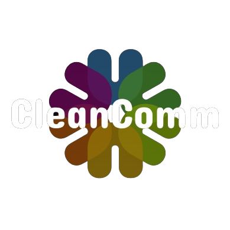

<p align="center">
  
</p>

# CleanComm - A Community-driven Waste Management Platform

<p align="center">
  
</p>

## Overview

CleanComm is a web-based platform designed to empower communities to effectively manage waste and promote environmental sustainability. Through interactive features, users can report waste sightings, organize cleanup events, access educational resources, and track progress in their local areas. **Car 

### Learning objectives

#### Fundamental regulations

1. Gain practical experience in web development and project management.
2. Apply software engineering principles to address real-world environmental challenges.
3. Foster community engagement and collaboration through technology.

### Features

- **User Authentication**: Secure login and registration using JWT.
- **User Management**: Create, read, update, and delete user profiles.
- **Email Services**: Sending emails for verification and notifications.
- **Database Utilities**: Efficient interaction with the MySQL database.

### Installation

#### Prerequisites

- Python 3.8+
- MySQL

#### Steps

1. **Clone the Repository**:

   ```sh
   git clone https://github.com/Katz92/Cleancomm.git
   cd Cleancomm/backend
   ```

2. **Create and Activate a Virtual Environment**:

   ```sh
   python -m venv venv
   source venv/bin/activate   # On Windows use `venv\Scripts\activate`
   ```

3. **Install Dependencies**:

   ```sh
   pip install -r requirements.txt
   ```

4. **Configure Database**:

   - Update the database configuration in `app/resources/db_utils/db_utils.py` to match your PostgreSQL settings:

     ```python
     DB_USER = 'cleancommdev'
     DB_PASSWORD = 'cleancommdev_pwd'
     DB_HOST = 'localhost'
     DB_PORT = '5432'
     DB_NAME = 'cleancommdevdb'
     ```

5. **Run the Application**:

   ```sh
   uvicorn main:app --reload
   ```

### Usage

After starting the application, the API will be available at `http://127.0.0.1:8000`. You can use tools like Postman or cURL to interact with the endpoints.

### Project Modules

- **controllers**: Contains the main logic for handling authentication (`auth.py`).
- **models**: Defines the database models and schemas.
- **pydantic**: Contains Pydantic models for data validation.
- **resources**: Utilities and helper functions for database interactions and other resources.
- **services**: Additional services like email sending.
- **test**: Contains unit tests for different modules.

### Logging

- `app_access.log`: Logs all access requests.
- `app_errors.log`: Logs any errors that occur within the application.

### Assets

- Contains images and other static assets used in the project.

### Running Tests

Tests are located in the `test` directory. To run tests, use the following command:

```sh
pytest
```

### Contributing

We welcome contributions to improve CleanComm API. Please fork the repository and submit a pull request.

### License

This project is licensed under the [MIT License](LICENSE).

---

Feel free to reach out if you have any questions or need further assistance.

Happy coding! 🚀

## Acknowledgments

- Logo design by [Guy Ahonakpon GBAGUIDI](https://www.linkedin.com/in/guy-ahonakpon-gbaguidi).
