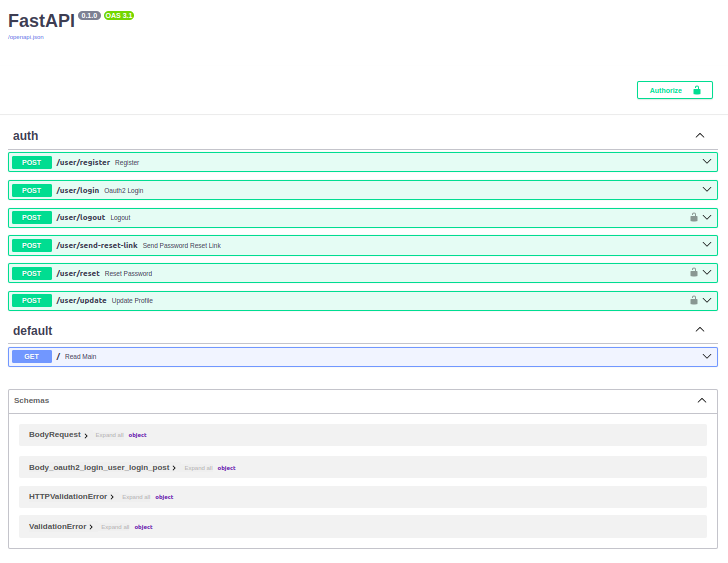

# CleanComm API

## Overview

CleanComm API is an authentication API developed using Python with the FastAPI framework and PostgreSQL as the database. This API provides robust authentication mechanisms and related utilities to ensure secure and efficient user management.

### Project Structure

```text
├── app
│   ├── controllers
│   │   ├── auth.py
│   │   └── __init__.py
│   ├── __init__.py
│   ├── models
│   │   ├── __init__.py
│   │   └── user.py
│   ├── pydantic
│   │   ├── __init__.py
│   │   └── models.py
│   ├── resources
│   │   ├── db_utils
│   │   │   ├── db_utils.py
│   │   │   ├── __init__.py
│   │   │   ├── user_queries.py
│   │   │   └── user_utils.py
│   │   ├── dependencies.py
│   │   ├── __init__.py
│   │   ├── required_packages.py
│   │   └── type
│   │       ├── __init__.py
│   │       ├── options.py
│   │       └── status.py
│   └── services
│       ├── apphttpbearer.py
│       ├── __init__.py
│       └── send_mail.py
├── app_access.log
├── app_errors.log
├── assets
│   ├── logocc1.png
│   └── logocc2.png
├── main.py
├── logger.py
├── README.md
├── requirements.txt
└── test
    ├── apphttpbearer_test.py
    ├── auth_test.py
    ├── config.json
    ├── conftest.py
    ├── __init__.py
    ├── requiredPackages_test.py
    ├── sendMail_test.py
    └── user_test.py
```

### Features

- **User Authentication**: Secure login and registration using JWT.
- **User Management**: Create, read, update, and delete user profiles.
- **Email Services**: Sending emails for verification and notifications.
- **Database Utilities**: Efficient interaction with the PostgreSQL database.

### Installation

#### Prerequisites

- Python 3.8+
- PostgreSQL

#### Steps

1. **Clone the Repository**:

    ```sh
    git clone https://github.com/Katz92/Cleancomm.git
    cd Cleancomm/backend
    ```

2. **Create and Activate a Virtual Environment**:

    ```sh
    python -m venv venv
    source venv/bin/activate   # On Windows use `venv\Scripts\activate`
    ```

3. **Install Dependencies**:

    ```sh
    pip install -r requirements.txt
    ```

4. **Configure Database**:
    - Copy the `.env.dist` to `.env`
    - Update the database configuration in `.env` to match your PostgreSQL settings:

        ```env
        DB_USER = 'cleancommdev'
        DB_PASSWORD = 'cleancommdev_pwd'
        DB_HOST = 'localhost'
        DB_PORT = '5432'
        DB_NAME = 'cleancommdevdb'
        ```

5. **Run the Application**:

    ```sh
    uvicorn main:app --reload
    ```

### Usage

After starting the application, the API will be available at `http://127.0.0.1:8000`. You can use tools like Postman or cURL to interact with the endpoints.

### Project Modules

- **controllers**: Contains the main logic for handling authentication (`auth.py`).
- **models**: Defines the database models and schemas.
- **pydantic**: Contains Pydantic models for data validation.
- **resources**: Utilities and helper functions for database interactions and other resources.
- **services**: Additional services like email sending.
- **test**: Contains unit tests for different modules.

You can access the swagger of the API to have an overview of the routes and try them out at "server_url/docs".
If executed in local it will be <http://127.0.0.1:8000/docs/>. It should look like something like this



You can also access the alternative docs at the "/redoc" endpoint.

auth includes all the routes related to user authentication. We have:

- **/user/register**: register a new user
- **/user/login**: log in a user with an email and password.
- **/user/send-reset-link**: send a mail to user with a reset password link
- **/user/reset**: allow user to reset his password
- **/user/update-profil**: update the user profil information

### Logging

- `app_access.log`: Logs all access requests.
- `app_errors.log`: Logs any errors that occur within the application.

### Assets

- Contains images and other static assets used in the project.

### Running Tests

Tests are located in the `test` directory. To run tests, use the following command:

```sh
pytest
```

### Contributing

We welcome contributions to improve CleanComm API. Please fork the repository and submit a pull request.

### License

This project is licensed under the MIT License.

---

Feel free to reach out if you have any questions or need further assistance.

Happy coding! 🚀
